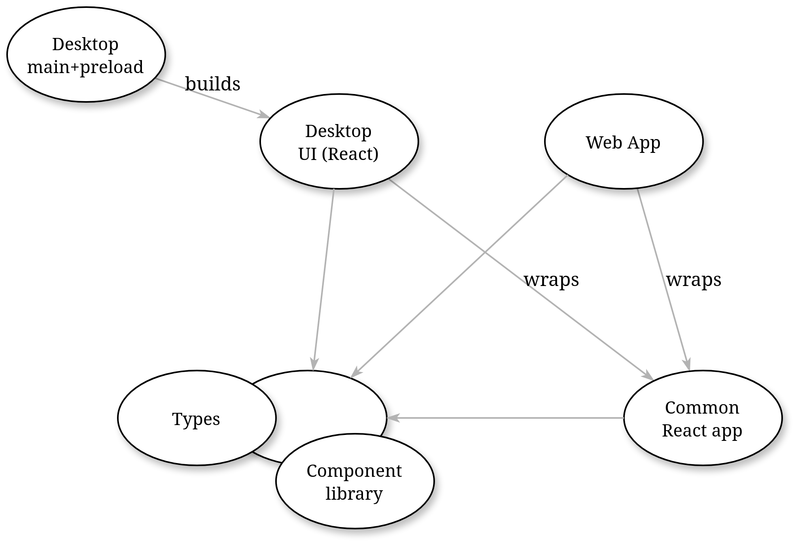

# Multiplatform Web/Electron app example

Example Electron app built using TypeScript, Vite and React.  
It can be built both as an Electron desktop app as well as SPA for web deployment (limited functionality).  
Note that this is **not** a template, only a demo app.

The project is a monorepo of several `yarn` workspaces for clear separation of web-only, desktop-only and common code:
- [app](packages/app) – the common React app wrapped by `web` and `desktop-ui`
- [web](packages/web) – Web React app incl. build & dev server script 
- [desktop-ui](packages/desktop-ui) – Electron renderer React app
- [desktop](packages/desktop) – Electron main+preload, incl. build & dev server for main+preload+renderer 
- [types](packages/types) – common type interfaces (e.g. app state, external APIs etc.)
- [components](packages/components) – UI components library



## Setup
```
yarn i
```

## Run dev server
```
yarn run dev:web
yarn run dev:desktop
```

## Build
```
yarn run build:web
yarn run build:desktop
```
